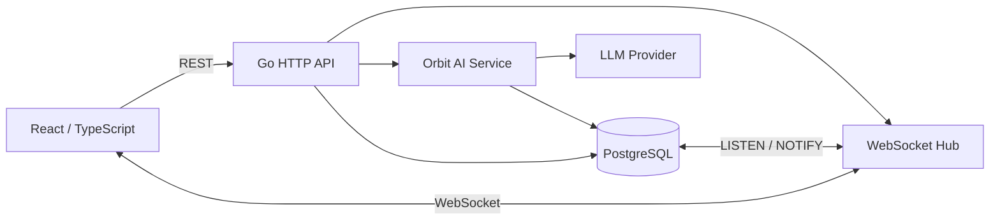

# Orbit Chat

[](https://github.com/naoki-webdev/chat/actions/workflows/ci.yml)

GoとReact / TypeScriptで構築したリアルタイムチャットアプリ。

チャンネル、ダイレクトメッセージ、スレッドに対応。メッセージやリアクションをWebSocketで同期し、切断後は保存済みイベントから不足分を復元。


## なぜ作ったか

チャットで扱うのはメッセージだけではなく、通信切断時の復帰、未読位置、チャンネルごとの権限、複数ユーザーによる同時操作といった状態管理。

WebSocketを通知経路に限定し、メッセージとイベントをPostgreSQLへ保存する構成。リアルタイム更新と履歴取得を分離し、再接続時の差分取得を可能にした設計。

## 機能

- チャンネル、ダイレクトメッセージ、スレッド
- メッセージの編集、削除、リアクション
- Typing / Presence、未読状態の保存
- 保存済みメッセージ、会話内検索
- チャンネル作成、参加メンバーの招待と削除
- owner / adminによるチャンネル設定の変更
- WebSocket切断後のイベント復元
- Orbit AIとのDM、ストリーミング応答
- 未読メッセージから会話の要点を整理

## 構成



REST APIは認証、履歴取得、メッセージ操作、チャンネル管理を担当。WebSocketはリアルタイムイベントを配信。

メッセージとイベントの正本はPostgreSQLに保存。AI ProviderのAPIキーはGoバックエンドだけで管理。

PostgreSQLを使う構成では、`LISTEN / NOTIFY`で複数のGoインスタンスへイベント発生を通知。各インスタンスのHubから接続中のブラウザへ配信し、通知の取りこぼしは`sequence`による差分同期で復元。

## 設計

### 切断復帰

`chat_events.sequence`をイベントカーソルとして保存。

```text
101 message.created
102 message.created
103 reaction.added
104 message.updated
```

再接続時の取得対象は、最後に受信したsequenceより後のイベント。

```text
GET /api/events?after=:sequence
```

再接続時にsequence以降の差分を同期。global sequenceは権限外イベントで飛ぶため、接続中のsequenceの飛びは欠落とみなさない。送信バッファが満杯になったslow clientは切断し、再接続時に不足イベントを復元。

### 未読とチャンネル権限

チャンネルごとの既読位置を`channel_read_states.last_read_sequence`に保存。メッセージの編集や削除後も既読位置を維持。

チャンネル参加者は`channel_members`で管理。履歴、スレッド、リアクション、イベント差分、WebSocket購読、Typingイベントの各処理でmembershipを確認。WebSocket配信ではチャンネル参加者のsnapshotを取得し、接続クライアントごとのDB問い合わせを抑制。

### メッセージとスレッド

履歴とスレッドの返信は`before`カーソルで古いページを取得。

スレッドのroot削除時は本文だけをsoft deleteし、返信を保持。返信自体を削除しても、通常のチャンネルメッセージには戻らない仕様。

リアクションは`UNIQUE(message_id, user_id, emoji)`相当の制約で重複を防止。メッセージと対応するイベントは同じDB transaction内で保存。

## Orbit AI

Orbit AIとのDMでは、GoがLLM Providerから応答を受け取り、`message.ai_started`、`message.ai_delta`、`message.ai_completed`、`message.ai_failed`としてWebSocketへ配信。完成した回答は通常のメッセージとイベントとして保存し、生成中に切断しても完了後は履歴から確認可能。

会話の要点は未読メッセージを優先して読み、未読がない場合は直近のメッセージを対象にする。スレッド返信も要約コンテキストに含め、決定事項、依頼・次の作業、未解決事項、雑談に分類。分類結果には元メッセージへの参照付き。

`AI_PROVIDER`でGemini、OpenAI、Ollama、OpenRouter、Amazon Bedrockを切り替え可能。開発時は`AI_PROVIDER=mock`で外部APIなしの動作確認。設定例は[backend/.env.example](./backend/.env.example)。

## 技術構成

- Frontend: React / TypeScript / Vite
- Backend: Go / `net/http` / Gorilla WebSocket
- Database: PostgreSQL / versioned SQL migrations
- Auth: bcrypt / HttpOnly Cookie / DB-backed session
- Test: Vitest / Playwright / Go test / race detector
- CI: GitHub Actions

## 認証と運用

パスワードのbcryptハッシュ化。ログインセッションはtokenのhashだけをDBへ保存。ブラウザにはHttpOnly Cookieを使用し、本番環境ではSecure属性を必須化。期限切れsessionは起動時と定期処理で削除。

ログインと登録にはIPアドレスとメールアドレスを組み合わせたRate Limitを設定。リバースプロキシの転送ヘッダーは既定では不使用。有効化する場合は`TRUSTED_PROXY_CIDRS`と`TRUSTED_PROXY_HOPS`で信頼範囲を指定。

## 起動

```bash
npm ci
npm run dev
```

別ターミナルでバックエンドを起動。`DATABASE_URL`を指定しない開発環境ではインメモリストアを使用。

```powershell
$env:APP_ENV = "development"
cd backend
go run ./cmd/server
```

PostgreSQLの設定と本番環境の必須変数は[backend/README.md](./backend/README.md)を参照。

## デモログイン

`APP_ENV=development`または`APP_ENV=test`でデモデータを有効化。次のアカウントでログイン可能。

```text
メールアドレス: demo@example.com
パスワード:     demo-password
```

本番環境でのデモユーザー自動作成なし。

## テスト

Frontend:

```bash
npm test
npm run build
npm run test:e2e
```

Backend:

```powershell
cd backend
go test ./...
go test -race ./...
```

GitHub Actionsで、フロントエンドのテストとビルド、Playwright E2E、Go test、race detector、PostgreSQL 16を使った認可とDBの統合テストを実行。
